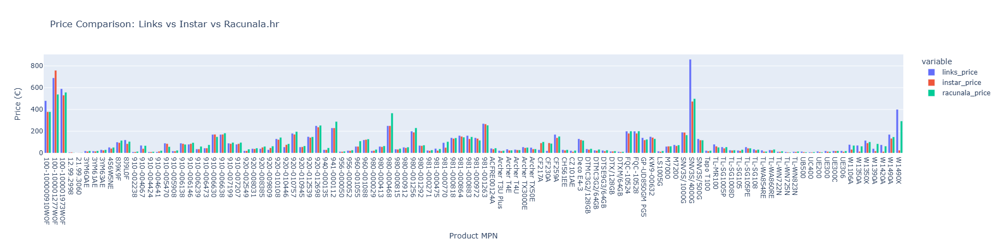

# Završni rad

## Price scraper project with database storing and visualisation of data

### Technologies/libraries used

- Scrapy - open source data extraction framework
  - scrapy starter project
  - built in spider crawlers for collecting data from webpages
- psycopg2 - PostgreSQL database adapter for Python 
  -  database access tool for accessing and storing data
- pandas - open source data analysis and manipulation tool
- plotly - Open Source Python Graphing and Data Visualization Library
  - transforming data into graphs 
- dash - low-code framework for rapidly building data apps in Python.
  - interactive web-page visualisation 

### Webpages

All webapges sell similar products, mostly focused on computers, phones and other electronics
- [Instar Informatika](https://www.instar-informatika.hr/)
- [Links](https://www.links.hr/)
- [Racunala.hr](https://www.racunala.hr/)

### Project structure

- [spiders](price_scraper/spiders) - contains all spider logic
    - [instar](price_scraper/spiders/instar.py)
    - [links](price_scraper/spiders/links.py)
    - [racunala.hr](price_scraper/spiders/racunala.py)
- [dashboard](price_scraper/dashboard.py) - visual representation of data
- [items](price_scraper/items.py) - item data fields
- [middleware](price_scraper/middleware.py) - scrapy built-in logic
- [pipelines](price_scraper/pipelines.py) - connectivity to database
- [settings](price_scraper/settings.py) - crawler behavior

### Visualisation

